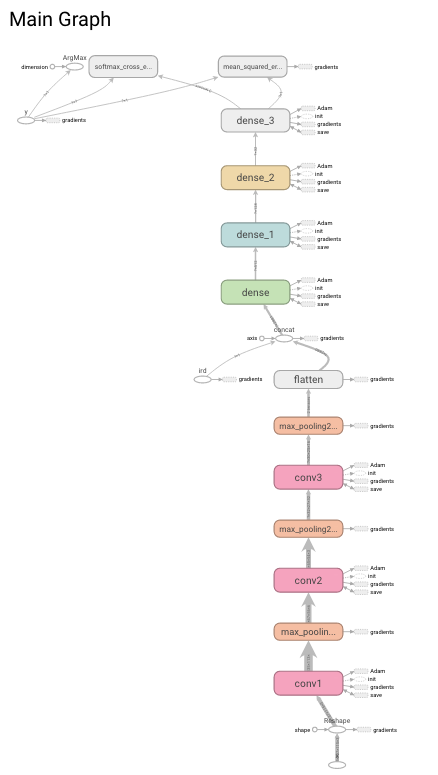
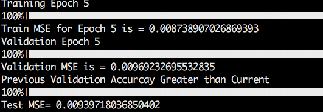
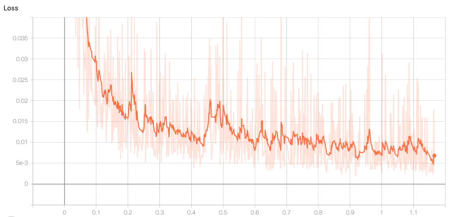
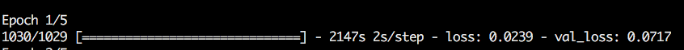

# nus_solar
Training scripts for the deepsolareye dataset

# Basic CNN

The trained model looks like this

The model got an MSE of 0.009 for testing. The results can be seen here

And the loss graph plotted on tensorboard looks like this

# MobileNet

A mobilenet model was also trained

The results for training after one epoch are as follows:

